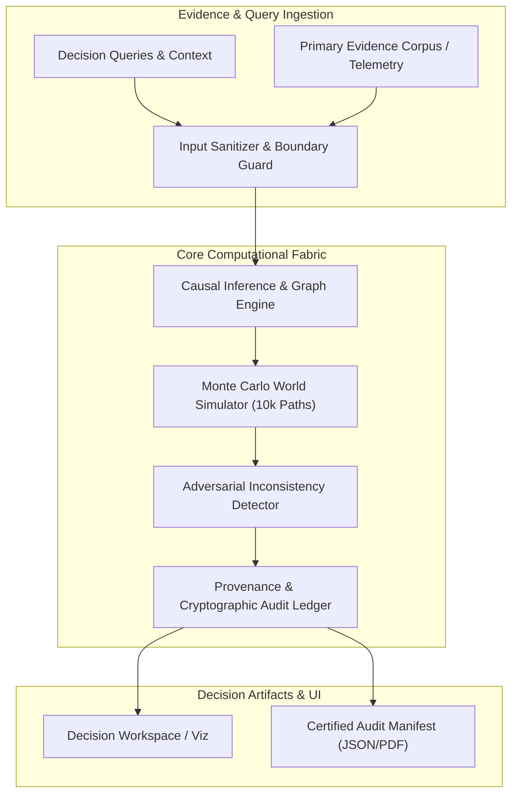
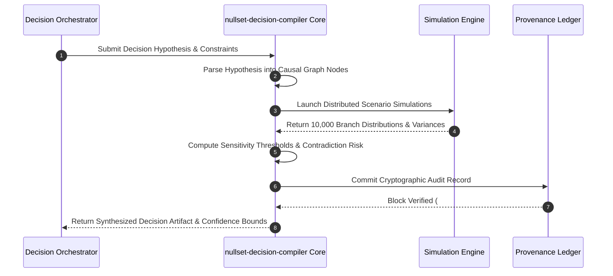
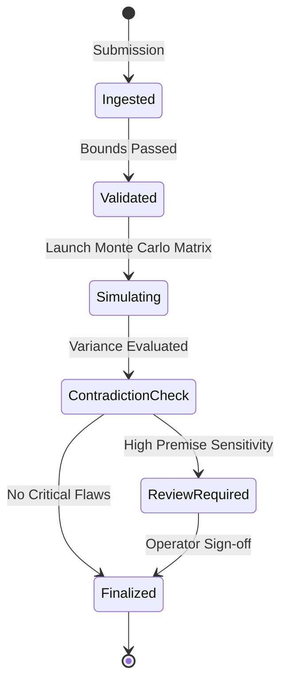

# nullset-decision-compiler: Architecture & System Topology

**Domain**: Minimum Evidence Discovery Engine to Overturn Decisions  
**Description**: Mathematical sensitivity solver identifying the minimum delta of new evidence required to reverse or invalidate a high-consequence decision.

## 1. System Topology & Data Pipeline

## 2. Decision Processing Sequence

## 3. Decision Lifecycle & State Transitions

## 4. Architectural Guarantees
- **Deterministic Replayability**: Given identical seeds and evidence snapshots, simulation outcomes match identically.
- **Audit Immutability**: All evidence citations and score mutations are signed and logged to the internal provenance ledger.
